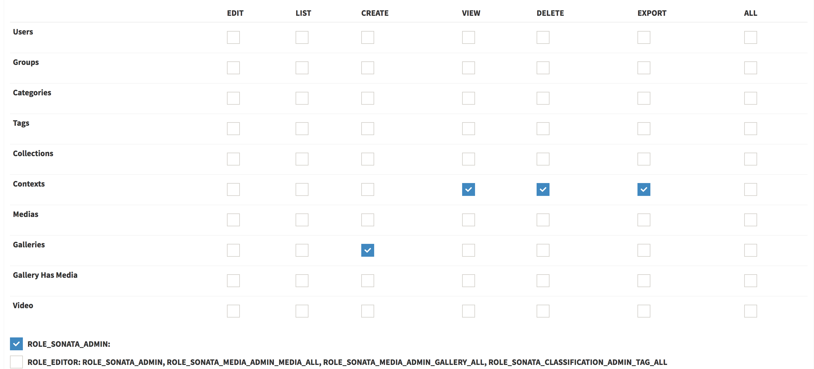

Roles Matrix
============

The ``Sonata\UserBundle\Form\Type\RolesMatrixType`` was built to show all
roles in a matrix view.

Every admin has defined default roles like:

    - EDIT
    - LIST
    - CREATE
    - VIEW
    - DELETE
    - EXPORT
    - ALL

The roles matrix consists of two parts:

1. one that shows the matrix with each admin and their permissions.
2. another that shows the custom roles which are configured in
   ``security.yml`` and lists them as checkboxes (and shows their
   inherited roles).

.. note::

   The user can just use roles which he is granted.

How to exclude an admin
-----------------------

You can set the ``show_in_roles_matrix`` option to ``false``, like this:

.. configuration-block::

    .. code-block:: yaml

        # config/services.yaml

        services:
            app.admin.post:
                class: App\Admin\PostAdmin
                tags:
                    -   name: sonata.admin
                        manager_type: orm
                        label: "Post"
                        show_in_roles_matrix: false
                arguments:
                    - ~
                    - App\Entity\Post
                    - ~
                public: true
